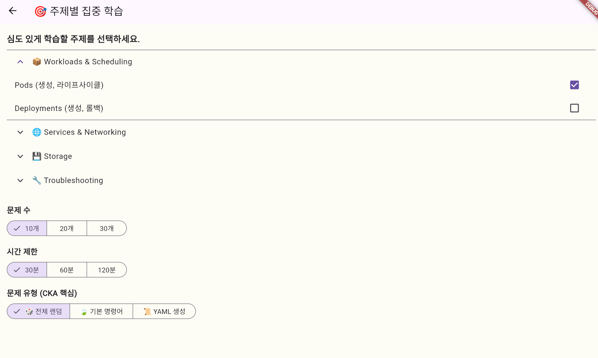
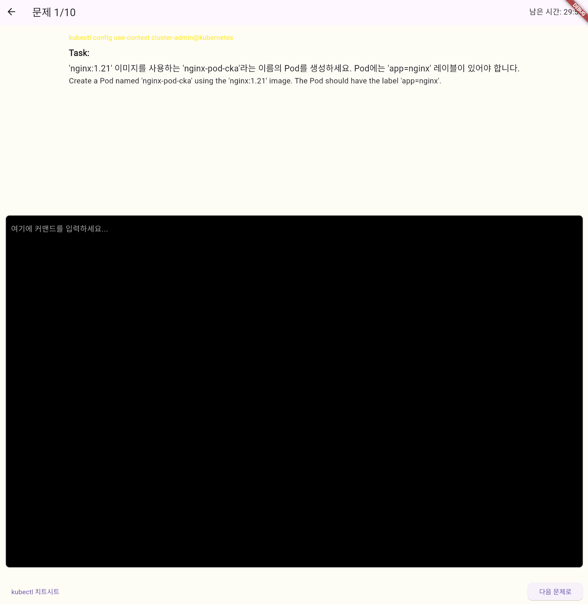
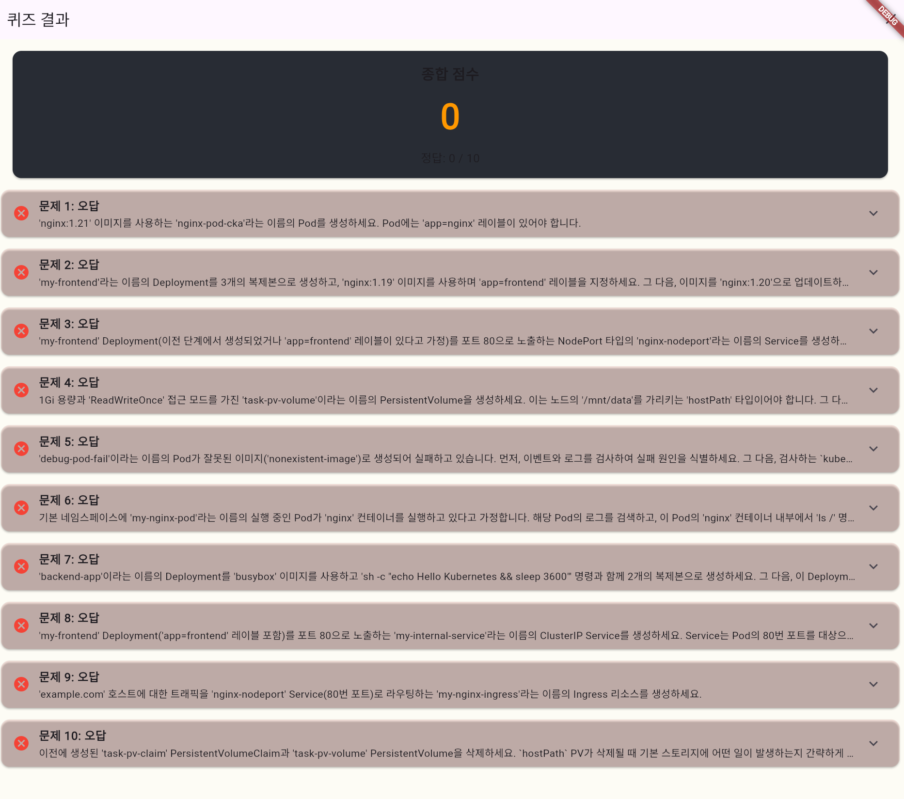
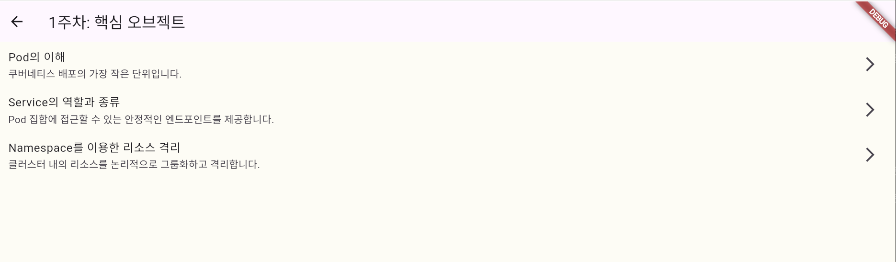
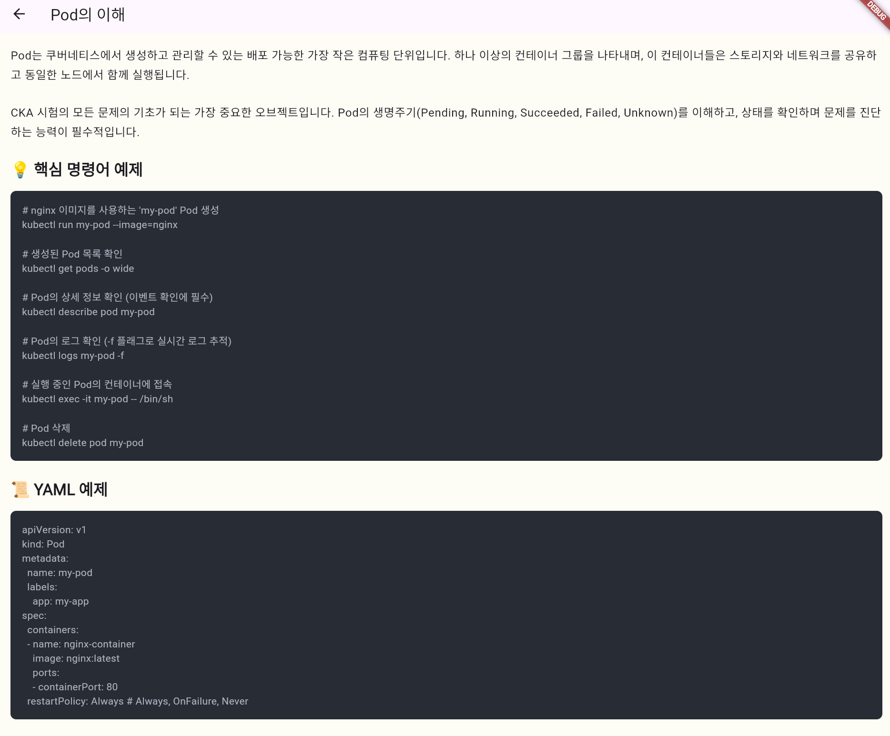

# 🇰🇷 CKA Master: 당신의 쿠버네티스 자격증 합격을 위한 AI 러닝메이트

**CKA Master**는 Flutter와 Google Gemini API를 기반으로 제작된 모바일 애플리케이션으로, Certified Kubernetes Administrator (CKA) 자격증 시험을 준비하는 학습자들에게 실제 시험과 가장 유사한 학습 경험을 제공하는 것을 목표로 합니다.

단순한 문제 풀이를 넘어, AI가 생성하는 동적 퀴즈와 체계적인 개념 학습 콘텐츠를 통해 사용자가 쿠버네티스에 대한 깊이 있는 이해를 갖도록 돕습니다.

## 📸 Screenshots


| Main Screen | Quiz Setup | Quiz Screen |
| :---: | :---: | :---: |
|  |  |  |
| **Result Screen** | **Concept List** | **Concept Detail** |
|  |  |  |

## ✨ 주요 기능 (Features)

*   **🤖 AI 기반 동적 퀴즈 생성 (Dynamic Quiz Generation)**
    *   Google의 최신 AI 모델인 **Gemini API**를 활용하여 매번 새로운 CKA 실기 문제를 실시간으로 생성합니다.
    *   정형화된 문제 은행 방식에서 벗어나, 사용자가 선택한 토픽에 맞춰 무한에 가까운 문제 조합을 경험할 수 있습니다.

*   **📚 체계적인 개념 학습 (In-depth Concept Study)**
    *   CKA 시험 범위를 기반으로 설계된 5주 완성 커리큘럼을 제공합니다.
    *   Pod, Service와 같은 핵심 오브젝트부터 스토리지, 네트워킹, 트러블슈팅까지 각 주제에 대한 상세한 설명과 필수 명령어, YAML 예제를 포함합니다.

*   **💻 실전과 같은 가상 터미널 (Mock Terminal Interface)**
    *   실제 CKA 시험 환경과 유사한 가상 터미널 환경에서 `kubectl` 명령어를 직접 입력하며 문제를 해결합니다.
    *   이를 통해 시험장에서의 긴장감을 줄이고 명령어 사용에 대한 근육 기억(muscle memory)을 형성할 수 있습니다.

*   **📊 자동 채점 및 상세 피드백 (Automated Scoring & Feedback)**
    *   퀴즈 종료 즉시 자동 채점 결과를 제공하며, 각 문제에 대한 정답/오답 여부와 함께 상세한 해설을 확인할 수 있습니다.
    *   모범 답안(명령어, YAML)과 핵심 개념 해설을 통해 틀린 문제를 완벽하게 이해하고 넘어갈 수 있도록 돕습니다.

*   **🇰🇷 한/영 동시 지원 (Bilingual Support)**
    *   모든 문제 지문과 해설은 한국어와 영어가 함께 제공되어, 명확한 의미 파악과 전문 용어 학습에 효과적입니다.

## 🛠️ 기술 스택 및 아키텍처 (Tech Stack & Architecture)

*   **Framework**: `Flutter` - 크로스플랫폼 개발을 위한 선택
*   **State Management**: `Riverpod` - 컴파일 타임에 안전하고 유연하며 테스트 용이성이 높은 상태 관리 라이브러리
*   **AI Model**: `Google Gemini API` (`google_generative_ai`) - 동적이고 지능적인 문제 생성을 위한 핵심 엔진
*   **API Key Management**: `flutter_dotenv` - 민감한 API 키를 코드와 분리하여 안전하게 관리
*   **Architecture**: `Repository Pattern` - 데이터 소스(AI, Mock Data)와 UI 로직을 분리하여 코드의 확장성과 유지보수성을 향상

## 🚀 시작하기 (Getting Started)

로컬 환경에서 프로젝트를 실행하고 테스트하기 위한 안내입니다.

### 사전 요구사항

*   Flutter SDK (v3.x.x 이상)
*   VS Code 또는 Android Studio와 같은 코드 에디터
*   Google Gemini API 키 (Google AI Studio에서 발급 가능)

### 설치 및 실행

1.  **리포지토리 클론:**
    ```bash
    git clone https://github.com/djlim33/k8s-quiz-app.git
    cd k8s-quiz-app
    ```

2.  **`.env` 파일 생성:**
    프로젝트 루트 디렉토리에 `.env` 파일을 생성하고, 발급받은 Gemini API 키를 입력합니다.

    ```
    GEMINI_API_KEY=YOUR_GEMINI_API_KEY_HERE
    APP_MODE=live # Mock 데이터로 테스트하려면 'mock'으로 변경
    ```

3.  **의존성 패키지 설치:**
    ```bash
    flutter pub get
    ```

4.  **애플리케이션 실행:**
    ```bash
    flutter run
    ```

## 📂 프로젝트 구조 (Project Structure)

```
lib/
├── models/         # Data models (CkaQuestion, Concept, etc.)
├── providers/      # Riverpod providers (CkaRepository, QuizController, etc.)
├── screens/        # UI screens (MainScreen, QuizScreen, etc.)
└── main.dart       # App entry point and routing
```

## 🤝 Contributing

Contributions, issues, and feature requests are welcome!
Feel free to check the issues page.

## 📜 License

This project is licensed under the MIT License - see the LICENSE file for details.

---